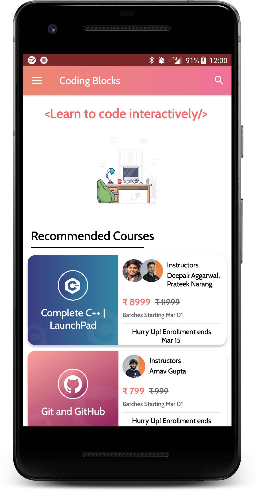
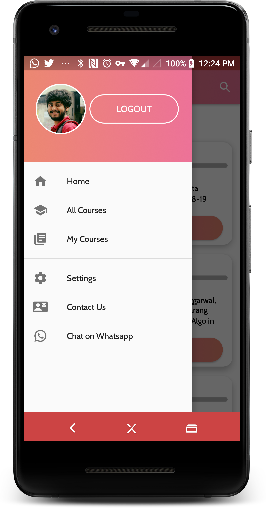
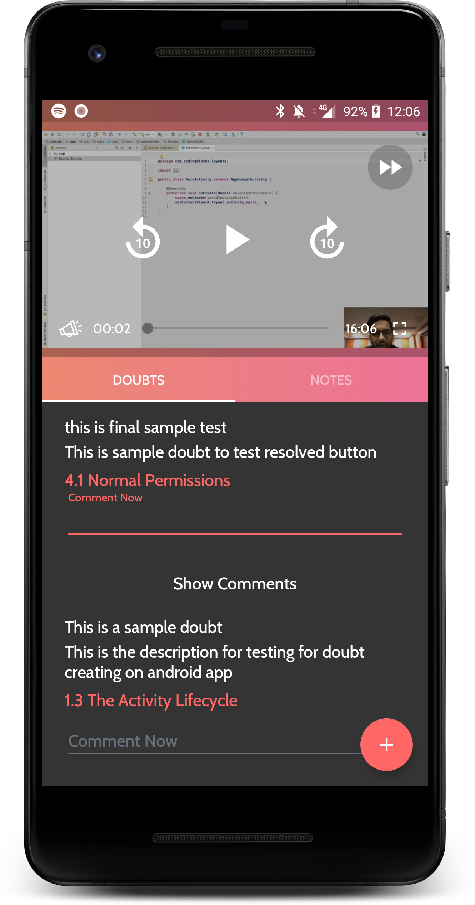

# CBOnlineApp
😎⚡️Online App for Coding Blocks Online

An app to consume online courses available at https://online.codingblocks.com

Application is available here:

## Screenshots
<table>
        <tr>
          <td></td>
          <td></td>
          <td></td>
          <td></td>
          <td></td>
        </tr>
</table>    

### Libraries used and their documentation

- Retrofit [Docs](http://square.github.io/retrofit/2.x/retrofit/)
- Picasso [Docs](http://square.github.io/picasso/)
- JSON API Converter [Docs](https://github.com/jasminb/jsonapi-converter)
- ExoMedia [Docs](https://devbrackets.com/dev/libs/docs/exomedia/4.0.0/index.html)
- Room Persistence Library [Docs](https://developer.android.com/topic/libraries/architecture/room)
