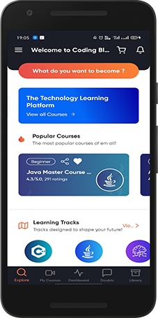
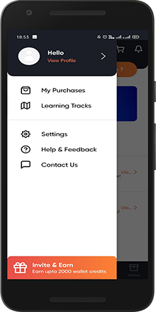
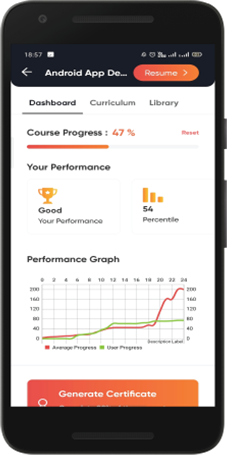
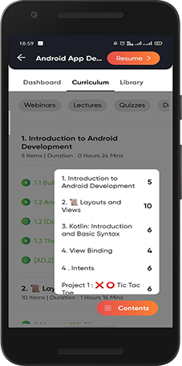
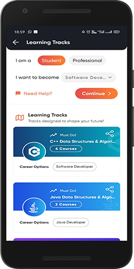
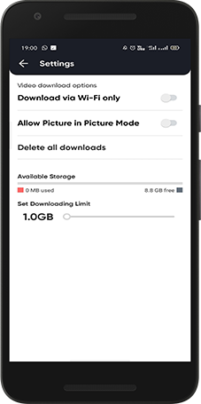

# CBOnlineApp
😎⚡️Online App for Coding Blocks Online

An app to consume online courses available at https://online.codingblocks.com

Application is available here:

## Screenshots
<table>
        <tr>
          <td></td>
          <td></td>
          <td></td>
        </tr>
        <tr>
        <td></td>
        <td></td>
        <td></td>
        </tr>
        <tr>
        <td></td>
        <td></td>
        <td></td>
        </tr>
</table>    

### Libraries used and their documentation

- Retrofit [Docs](http://square.github.io/retrofit/2.x/retrofit/)
- Picasso [Docs](http://square.github.io/picasso/)
- JSON API Converter [Docs](https://github.com/jasminb/jsonapi-converter)
- VideoCipher [Docs](https://legacysite.vdocipher.com/files/android_javadoc/1.0.0-beta1/)
- AndROuter [Docs](https://github.com/campusappcn/AndRouter)
- Koin [Docs](https://github.com/InsertKoinIO/koin)

## Contributions Best Practices

### For first time Contributors

First-time contributors can read [CONTRIBUTING.md](/CONTRIBUTING.md) file for help regarding creating issues and sending pull requests.

### Branch Policy

We have the following branches

 * **development** All development goes on in this branch. If you're contributing, you are supposed to make a pull request to _development_. PRs to development branch must pass a build check and a unit-test check on Circle CI.
 * **master** This contains shipped code. After significant features/bugfixes are accumulated on development, we make a version update and make a release.
### Code practices

Please help us follow the best practices to make it easy for the reviewer as well as the contributor. We want to focus on the code quality more than on managing pull request ethics.

 * Single commit per pull request
 * For writing commit messages please read the COMMITSTYLE carefully. Kindly adhere to the guidelines.
 * Follow uniform design practices. The design language must be consistent throughout the app.
 * The pull request will not get merged until and unless the commits are squashed. In case there are multiple commits on the PR, the commit author needs to squash them and not the maintainers cherrypicking and merging squashes.
 * If the PR is related to any front end change, please attach relevant screenshots in the pull request description.

### Join the development

* Before you join the development, please set up the project on your local machine, run it and go through the application completely. Press on any button you can find and see where it leads to. Explore. (Don't worry ... Nothing will happen to the app or you due to the exploring :wink: Only thing that will happen is, you'll be more familiar with what is where and might even get some cool ideas on how to improve various aspects of the app.)
* If you would like to work on an issue, drop in a comment at the issue. If it is already assigned to someone, but there is no sign of any work being done, please free to drop in a comment so that the issue can be assigned to you if the previous assignee has dropped it entirely.

## For Testers: Testing the App
If you are a tester and want to test the app, you have two ways to do that:
1. **Installing APK on your device:** You can get debug APK as well as Release APK in the apk branch of the repository. After each PR merge, both the APKs are automatically updated. So, just download the APK you want and install it on your device. The APKs will always be the latest one.
